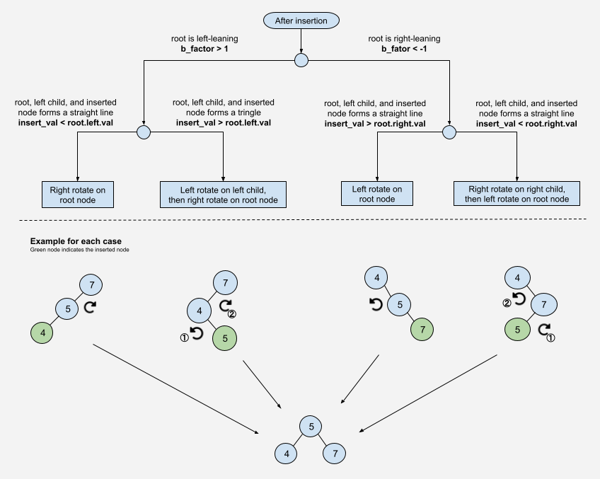

# Notes
## Definitions

`height_of_node = 1 + max(get_height(left_child), get_height(right_child))`

`balance_factor = get_height(left_child) - get_height(right_child)`

Balance factor of a balanced tree should always be in [-1, 0, 1].

## Decision tree for rotation to take after Insertion

