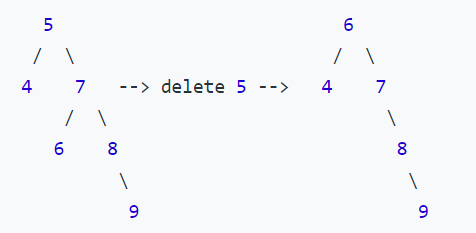

# Order Statistics Tree
This example relates to the follow-up question of [LeetCode 230](https://leetcode.com/problems/kth-smallest-element-in-a-bst/), which is using [Order Statistic Tree](https://en.wikipedia.org/wiki/Order_statistic_tree) to optimize.

My order statistic tree is based on stardard BST. It supports:
- `insert()`: in O(log n)
- `delete()`: include node size maintenance, in O(log n)
- `select()`: find the k-th smallest element in O(log n)
- `get_rank()`: get the rank of a node, i.e. its index in the sorted list of elements of the tree, in O(log N)

# Implementation
## Tree node
Compare to standard BST, `OSTreeNode` has one more property `size`, which is the number of its children plus one for itself. 

Also I assume **no mutiple nodes share the same value.**

```python
class OSTreeNode(object):
	def __init__(self, val=0, left: OSTreeNode = None, right: OSTreeNode = None):
		self.val = val
		self.left = left
		self.right = right
		self.size = 1
```

## Insert node
Simply add one to the size of each node during insert traversal:

```python
def _insert_node(root: OSTreeNode, new_node: OSTreeNode):
	if root.val > new_node.val:
		if not root.left:
			root.left = new_node
		else:
			_insert_node(root.left, new_node)
	else:
		if not root.right:
			root.right = new_node
		else:
			_insert_node(root.right, new_node)

	# size of the currnet node increase one after insert
	root.size += 1
```

## Delete node
The process of `delete()` is the same as standard BST so let me skip that. 

### Maintain node size
We need to maintain the node size after every deletion. Following [1], I have:

```python
def fix_all_sum(self, root: OSTreeNode) -> None:
	def _fix_sum(root: OSTreeNode) -> None:
		root.size = 1
		
		if root.left:
			root.size += root.left.size
		if root.right:
			root.size += root.right.size

        if root.left:
            self.fix_all_sum(root.left)

        if root.right:
            self.fix_all_sum(root.right)

	_fix_sum(root)
```

Of course we can call `fix_all_sum()` from the root of the tree every time `delete()` completes. However you might notice that not every node need to be maintained. 

For example, consider following tree node deletion (replace deleted node that has two children with the inorder successor):



The size of node 4, 8, 9 are not changed.

Quoted from [1]:
> Unfortunately, running FixAllSums after any insert or delete, or change in the value of any node, will take Θ(n) time. So instead we will be slightly more clever, and run it only on nodes whose descendants have changed... we can maintain the invariant by calling FixSum on all affected nodes at cost O(log n), which is swallowed by the O(log n) cost of the basic insert or delete

My approach is adding visited node during deletion traversal into a list. Then only run `fix_all_sum()` on these node:

```python
while curr and curr.val != target:
	parent = curr

	# add visited node into a list
	descendants_need_fix.append(parent)

	if curr.val > target:
		curr = curr.left

	elif curr.val < target:
		curr = curr.right
```

And modify condition to update node size

```python
if root.left in descendants_need_fix:
	self.fix_all_sum(root.left, descendants_need_fix)

if root.right in descendants_need_fix:
	self.fix_all_sum(root.right, descendants_need_fix)
```

**Question: is there a better way to track descendants without extra space?**

## Select the k-th element
The idea is comparing `k` with the left size of a node.

- `k < left_size`, the target node is one of its left children.
- `k > left_size`, the target node is one of its right children.
- `k == left_size`, we found it.

Where `left_size = curr.left.size + 1 if curr.left else 1`

```python
def select(self, k: int) -> OSTreeNode:
	def _select_kth_node(root: OSTreeNode, k: int):
		if not root:
			print(f'k={k} is greater than the total number of nodes.')
			return None

		left_size = root.left.size + 1 if root.left else 1

		if k == left_size:
			return root

		if k < left_size:
			return _select_kth_node(root.left, k)

		else:
		    # update k with minusing the left_size of current node
			return _select_kth_node(root.right, k - left_size)

	return _select_kth_node(self.root, k)
```

## Get the rank of a node
My thought is straightforward: compute how many number of nodes are smaller than the target node.

Similar to `select()`, from the tree root, compare target value and current node value, then add `left_size` of each node visted into `rank`. Finally, return `rank` when we get the destination.

```python
def get_rank(self, target: int) -> int:
	curr = self.root
	rank = 0

	while curr:
		if target >= curr.val:
			left_size = curr.left.size + 1 if curr.left else 1
			rank += left_size

			# end point
			if target == curr.val:
				break

			curr = curr.right

		else:
			curr = curr.left

	if not curr:
		print(f'Get rank failed: {target} not found')
		return -1

	else:
		return rank
```

# Reference
[1] https://www.cs.yale.edu/homes/aspnes/pinewiki/AggregateQueries.html

[2] https://www.cs.yale.edu/homes/aspnes/pinewiki/OrderStatisticsTree.html
